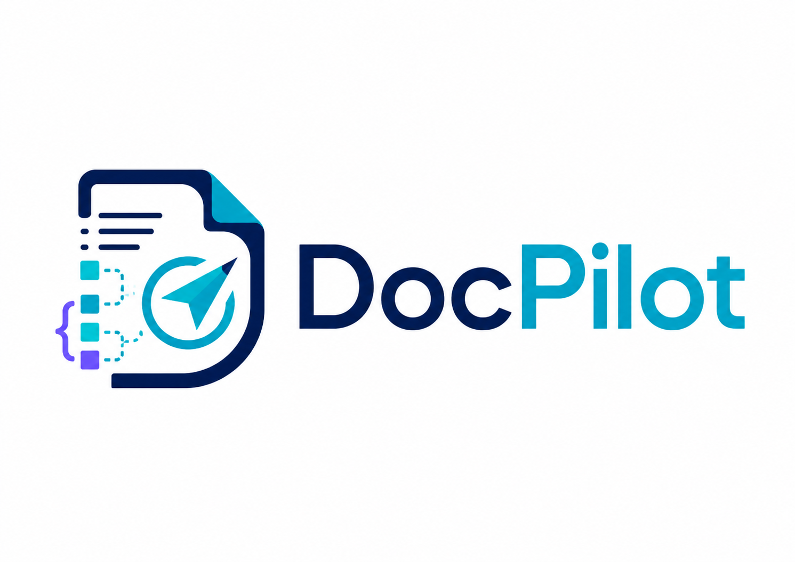

<div align="center">
  
  <p><strong>面向生产环境的文档解析服务</strong></p>
  <p>把 PDF、Office、图片、邮件和网页文档解析为 Markdown、structured JSON、chunks 和可复用资产。</p>
  <p>
    
    
    
  </p>
  <p>
    <a href="docs/API.md">API</a> |
    <a href="docs/DEPLOYMENT.md">部署</a> |
    <a href="docs/OPERATIONS.md">运维</a> |
    <a href="docs/EVALUATION.md">评测</a> |
    <a href="docs/PARSER_ENGINE_STRATEGY.md">引擎策略</a>
  </p>
</div>

DocPilot 是一个独立文档解析服务，聚焦 OCR、版面分析、结构化解析、切块和资产抽取，不负责问答、向量化、检索或回答生成。

## Highlights

- 多格式输入：支持 PDF、Office、图片、邮件、网页和常见文本类文件。
- 多引擎 PDF 解析：`docpilot`、`paddleocr_vl`、`mineru`、`plain`；其中 `docpilot` 为对外推荐名称，兼容旧别名 `deepdoc`。
- 结构化输出：可返回 Markdown、`structured.json`、`chunks.jsonl`、`ingest.jsonl` 和图片/表格/公式等 assets。
- 生产能力：内置 `/health`、`/ready`、`/metrics`、artifact 持久化和异步任务接口。

## Quick Start

### 1. Install

```bash
conda create -n docpilot python=3.10
conda activate docpilot

pip install -e .
```

可选依赖：

```bash
pip install -e ".[gradio]"
pip install -e ".[artifact-s3]"
pip install -e ".[ingest-postgres]"
```

### 2. Download Models

```bash
python download_models.py core
```

### 3. Run

```bash
# API
python main.py

# Gradio console (optional)
python gradio_app.py

# Docker
docker compose up -d
```

默认入口：

- API: `http://localhost:8000`
- Swagger UI: `http://localhost:8000/docs`
- OpenAPI: `http://localhost:8000/openapi.json`
- Gradio: `http://localhost:7860`

### 4. Parse a Document

```bash
curl -X POST "http://localhost:8000/api/v1/parse" \
  -F "parser_engine=docpilot" \
  -F "return_structured=true" \
  -F "persist_artifacts=true" \
  -F "include_chunks=true" \
  -F "file=@/path/to/document.pdf"
```

## Docs

- [docs/API.md](docs/API.md): 同步解析、流式解析、异步任务、artifact、ingest 接口
- [docs/DEPLOYMENT.md](docs/DEPLOYMENT.md): 本地安装、模型下载、Docker、artifact backend、ingest 配置
- [docs/OPERATIONS.md](docs/OPERATIONS.md): `health`、`ready`、`metrics`、审计、自检、日志和 tracing
- [docs/EVALUATION.md](docs/EVALUATION.md): 数据集约束、license gate、A/B 评测、readiness gate、profile
- [docs/PARSER_ENGINE_STRATEGY.md](docs/PARSER_ENGINE_STRATEGY.md): 多引擎选择建议、兼容策略、PDF 路由说明

## Notes

- 默认模型目录：`resources/models`
- 容器内模型目录：`/app/resources/models`
- 部分非 PDF 解析路径依赖 Java / Tika

## License

Apache 2.0
