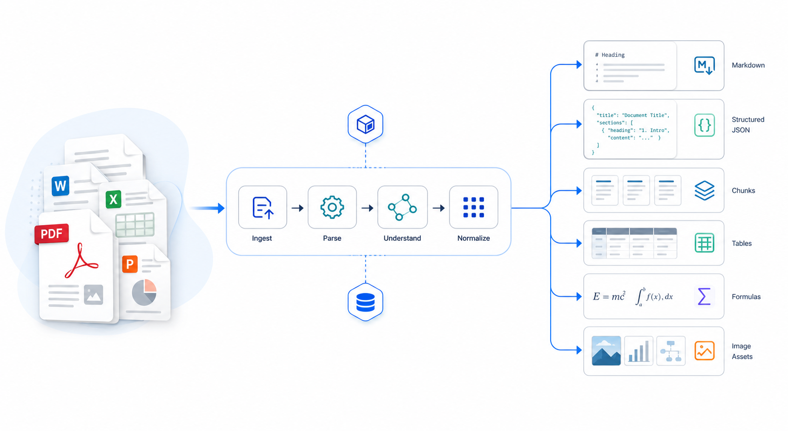

<div align="center">
  
  <p><strong>面向生产环境的文档解析服务</strong></p>
  <p>把 PDF、Office、图片、邮件和网页文档解析为 Markdown、structured JSON、chunks 和可复用资产。</p>
  <p>
    <a href="docs/API.md">API</a> |
    <a href="docs/DEPLOYMENT.md">部署</a> |
    <a href="docs/OPERATIONS.md">运维</a> |
    <a href="docs/EVALUATION.md">评测</a> |
    <a href="docs/PARSER_ENGINE_STRATEGY.md">引擎策略</a>
  </p>
  <p>
    
    
    
    
  </p>
</div>

DocPilot 是一个独立文档解析服务，负责把多种文档输入转换成可直接被业务系统消费的结构化结果。它聚焦在 OCR、版面分析、文档解析、切块和资产抽取，不负责问答、向量化、检索或回答生成。



## Why DocPilot

- 多格式输入：支持 PDF、Office、图片、邮件、网页和多种文本类文件。
- 多引擎路由：PDF 支持 `docpilot`、`paddleocr_vl`、`mineru`、`plain`，非 PDF 可显式走 `markitdown`。
- 结构化输出：除了 Markdown，还能返回 `structured.json`、`chunks.jsonl`、`ingest.jsonl` 和图片/表格/公式等 assets。
- 可生产落地：内置 `/health`、`/ready`、`/metrics`、审计、自检、artifact 持久化和异步任务接口。
- 本地可部署：支持本地 Python、CPU Docker、GPU Docker 和 Gradio 调试控制台。

## Scope

| 包含 | 不包含 |
|---|---|
| OCR、版面分析、表格识别、公式/印章/条码资产抽取 | 问答、RAG 检索、向量化、回答生成 |
| 同步解析、流式解析、异步任务、artifact 持久化 | 通用知识库管理后台 |
| Markdown、structured JSON、chunks、ingest records | 上层业务编排逻辑 |

## Supported Inputs

| 类别 | 格式 |
|---|---|
| PDF / 电子文档 | `pdf`、`caj`、`epub` |
| Office | `docx`、`pptx`、`ppt`、`xlsx`、`xls`、`rtf`、`odt` |
| Web / Text | `html`、`json`、`xml`、`md`、`txt`、`csv`、`tsv` |
| Mail / Archive | `eml`、`msg`、`zip` |
| Image | `png`、`jpg`、`jpeg`、`bmp`、`tiff`、`webp` |

## Parser Engines

| 引擎 | 适用场景 | 说明 |
|---|---|---|
| `docpilot` | 默认本地解析 | 对外推荐名称，兼容旧别名 `deepdoc` |
| `paddleocr_vl` | 更强视觉理解、印章等视觉能力 | 远程引擎 |
| `mineru` | 复杂 PDF 或特定版面场景 | 远程引擎 |
| `plain` | 只取 PDF 文本层 | 轻量、最快 |
| `markitdown` | 非 PDF 富文本转 Markdown | 适用于 Office / HTML 等 |

更细的选择建议见 [docs/PARSER_ENGINE_STRATEGY.md](docs/PARSER_ENGINE_STRATEGY.md)。

## Quick Start

### 1. Local Install

```bash
conda create -n deepdoc python=3.10
conda activate deepdoc

pip install -e .
```

如需 Gradio 控制台或其他可选能力：

```bash
pip install -e ".[gradio]"
pip install -e ".[artifact-s3]"
pip install -e ".[ingest-postgres]"
```

### 2. Download Models

```bash
# 最小本地 PDF 解析模型组
python download_models.py core

# 完整发布模型组
python download_models.py published
```

### 3. Run the Service

```bash
# API 服务
python main.py

# 本地调试用 Gradio 控制台（可选）
python gradio_app.py
```

默认端口：

- API: `http://localhost:8000`
- Swagger UI: `http://localhost:8000/docs`
- OpenAPI: `http://localhost:8000/openapi.json`
- Gradio: `http://localhost:7860`

### 4. Smoke Test

```bash
curl -X POST "http://localhost:8000/api/v1/parse" \
  -F "parser_engine=docpilot" \
  -F "return_structured=true" \
  -F "persist_artifacts=true" \
  -F "include_chunks=true" \
  -F "file=@/path/to/document.pdf"
```

## Docker Quick Start

```bash
docker compose up -d
```

默认 `docker-compose.yml` 只启动 API 服务，并使用 `Dockerfile.cpu`。GPU 部署、模型自动下载、artifact backend 和 ingest 发布配置见 [docs/DEPLOYMENT.md](docs/DEPLOYMENT.md)。

## API Example

下面这个请求会返回 Markdown，并同时产出结构化结果、chunks 和持久化 artifacts：

```bash
curl -X POST "http://localhost:8000/api/v1/parse" \
  -F "parser_engine=docpilot" \
  -F "deepdoc_pdf_mode=auto" \
  -F "return_structured=true" \
  -F "persist_artifacts=true" \
  -F "include_chunks=true" \
  -F "chunk_strategy=asset_aware" \
  -F "file=@/path/to/document.pdf"
```

典型返回字段包括：

- `content`: Markdown 内容
- `parser_engine`: 实际解析引擎
- `parse_id`: 本次解析 ID
- `structured`: 文档级结构化结果
- `artifact_urls`: Markdown、structured、chunks、assets 的访问地址
- `chunk_count` / `asset_count`: 产物规模摘要

更完整的同步、流式、异步任务和 artifact 接口见 [docs/API.md](docs/API.md)。

## Output Artifacts

当开启 `return_structured=true` 或 `persist_artifacts=true` 时，常见产物如下：

| 产物 | 说明 |
|---|---|
| `content` | Markdown 主结果 |
| `structured.json` | 文档、blocks、assets、chunks 的完整结构化表示 |
| `chunks.jsonl` | 面向检索或业务消费的切块导出 |
| `ingest.jsonl` | 面向下游 ingest 流程的记录导出 |
| `assets/` | 表格、图片、公式、印章、条码等附属资产 |

## Project Layout

```text
main.py                  Flask API entry
gradio_app.py            Gradio 调试控制台
common/                  配置、日志、artifact、ingest、async task、公用工具
deepdoc/vision/          OCR、layout、table structure、ONNX 推理
deepdoc/parser/          PDF / Office / HTML / JSON / Markdown 等解析器
docs/                    API、部署、运维、评测、引擎策略文档
tools/                   评测、profile、辅助脚本
```

## Documentation

| 文档 | 说明 |
|---|---|
| [docs/API.md](docs/API.md) | 同步解析、流式解析、异步任务、artifact、ingest 接口 |
| [docs/DEPLOYMENT.md](docs/DEPLOYMENT.md) | 本地安装、模型下载、Docker、artifact backend、ingest 配置 |
| [docs/OPERATIONS.md](docs/OPERATIONS.md) | `health`、`ready`、`metrics`、审计、自检、日志和 tracing |
| [docs/EVALUATION.md](docs/EVALUATION.md) | 数据集约束、license gate、A/B 评测、readiness gate、profile |
| [docs/PARSER_ENGINE_STRATEGY.md](docs/PARSER_ENGINE_STRATEGY.md) | 多引擎选择建议、兼容策略、PDF 路由说明 |

## Validation

当前仓库没有标准 `pytest` 测试套件，常用验证方式如下：

```bash
uv run ruff check .
curl -X POST "http://localhost:8000/api/v1/ocr" -F "file=@sample.png"
curl -X POST "http://localhost:8000/api/v1/parse" -F "file=@sample.pdf"
python deepdoc/vision/t_ocr.py --inputs /path/to/image.png --output_dir ./debug_ocr
```

## Notes

- 默认模型目录：`resources/models`
- 容器内模型目录：`/app/resources/models`
- 部分非 PDF 路径依赖 Java / Tika，请保证 `java` 在 PATH 中
- GPU 路径需要宿主机 CUDA 驱动和可用的 ONNX Runtime GPU provider

## License

Apache 2.0
